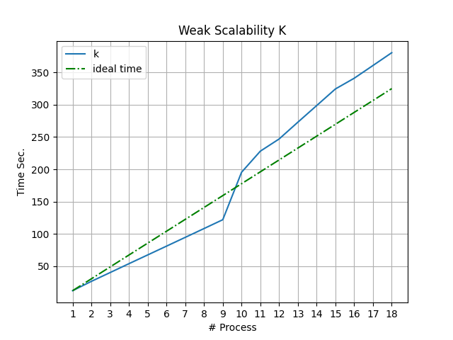

# N-body Read Me


# Sommario.
1. Presentazione della soluzione proposta

2. Esposizione della struttura del progetto

	2.1  Descrizione del codice 

		2.1.1 nbody.c
		2.1.2 util_body.h
	2.2 Compilazione del programma
3. Analisi delle prestazioni del programma
	
	3.1 Scalabilità Debole
	
	3.2 Scalabilità Forte

	3.3 Descrizione dei risultati
4. Conclusioni

#  1. Presentazione della soluzione proposta
Il **problema N-Body** è uno dei problemi più fertili della fisica matematica , affrontato multidisciplinarmente, per scopi diversi, dai fisici interessati alla meccanica celeste e alla fisica del sistema solare, dagli ingegneri nel calcolo di traiettorie di velivoli spaziali, e dai matematici esperti di teoria del caos.

Tale problema, prevede di individuare la posizione e la velocità di un insieme di particelle che interragiscono tra loro in un determinato lasso di tempo.

La soluzione proposta simula il comportamento di un insieme di particelle che vengono influenzate da "forze fisiche" , calcolando ad ogni istante di tempo la nuova posizione e velocità di ogni particella.

Tale soluzione è quadratica, in quanto per calcolare ad ogni istante di tempo le posizioni di ogni particella, ognuna di esse viene confrontata con tutte le altre.

Partendo da tale problema, ho sviluppato un algoritmo parallelo basato sul protocollo di comunicazione Message Passing Interface utilizzando la implementazione Open MPI. 


#  2. Esposizione della struttura del progetto

## 2.1 Descrizione del codice

La soluzione proposta si suddivide in 3 parti :

1. Inizializzazione e split delle particelle da parte del processo master.
2. Simulazione del BodyForce per K iterazioni.
3. Collect delle posizioni e velocità delle particelle da parte del processo master dopo aver eseguito la simulazione.

##### *1. Inizializzazione e split delle particelle*

Nella soluzione proposta, viene data in input la taglia delle particelle, ed il numero di iterazioni da effettuare durante la simulazione dell'algoritmo.
Partendo dalla taglia dell'input, il processo "*master*" utilizza un algoritmo deterministico per generare posizione e velocità di ogni particella in modo casuale.
Dopo aver effettuato tale inizializzazione, il master si occupa di effettuare una suddivisione equa del numero di particelle con gli altri processi inviandole tramite una Scatterv.

##### *2. Simulazione del Body Force per K Iterazioni.*

A questo punto, inizia la parte **core** dell'algoritmo. 

Nel dettaglio, il problema N-Body prevede di confrontare, ad ogni iterazione, ogni particella **necessariamente** con tutte le altre presenti all'interno dello spazio applicativo. Ciò implica una complessità quadratica al problema, nonché nel calcolo parallelo alla necessità di fare particolare attenzione all'overhead di comunicazione che, se implementato in modo non efficiente può influenzare in modo diretto le prestazioni dell'algoritmo stesso : in tale fase infatti, ogni processo necessità di scambiare le proprie particelle con quelle di tutti gli altri processi.

Una prima attenzione è stata rivolta al tipo di dato da utilizzare per effettuare la comunicazione.

Per ogni particella vengono mantenute informazioni relative a posizione e velocità, ma per calcolare la nuova posizione di una particella locale, ogni processo necessita realmente soltanto delle "posizioni" delle particelle degli altri processi.

Dal punto di vista logico, per facilitare tale implementazione sono state utilizzate due strutture dati : 


```c {.numberLines}
typedef struct { float x, y, z; } PBody;//Position bodies.
typedef struct { float vx,vy,vz; } VBody;//Velocity bodies.
```

In questo modo, partendo dalla taglia N delle particelle che gli sono state assegnate, ogni processo dovrà gestire un array di PBody con le informazioni relative alla posizione ed un array di VBody per le informazioni relative alla velocità delle N particelle.
Il vantaggio dato dall'utilizzo di tale approcio, è che durante la simulazione del problema, ad ogni iterazione ogni processo dovrà comunicare soltanto le posizioni delle particelle (PBody), e non anche le velocità in quanto non necessarie.


A tal proposito, nella soluzione proposta viene utilizzato un tipo di dato derivato Struct, che permette di comunicare blocchi composti da 3 float.


Di seguito la dichiarazione ed il commit del tipo di dato derivato :

```c {.numberLines}
    MPI_Datatype bodies_datatp, old_types[1];
    int blockcounts[1];
    MPI_Aint offsets[1];
    // setup description of the  MPI_FLOAT fields velocityX,Y,Z OR PositionX,Y,Z
    offsets[0] = 0;
    old_types[0] = MPI_FLOAT;
    blockcounts[0] = 3;

    MPI_Type_create_struct(1, blockcounts, offsets, old_types, &bodies_datatp);
    MPI_Type_commit(&bodies_datatp);
```

Poichè tale tipo di dato permette di comunicare blocchi composti da 3 float, non solo viene utilizzato durante la simulazione del body force ma anche durante la scatter e la gather delle posizioni e velocità delle particelle rispettivamente nella prima parte e nella terza parte dell'algoritmo.


Una seconda attenzione riguarda i tempi di attesa necessari da parte di un processo , nel ricevere le particelle degli altri processi. A tal proposito, la soluzione cerca di minimizzare gli stati "idle" , per ogni processo, nel seguente modo : 


```c {.numberLines}
    Ad ogni iterazione 
    {
		MPI_Request requests[tasks];
    float dt = 0.01f; // time step
    int idx=0;
    for(int root=0; root<tasks;++root){
        if(root==myRank){
           //Send Asyncronus Broadcast					  
          MPI_Ibcast(local_bodies,bodies_gsize[myRank],basic_bodiesdp,myRank,MPI_COMM_WORLD,&requests[myRank]);
        	//Invia le proprie particelle in modo asincrono a tutti gli altri processi tramite una IBcast
				}else{
            int pos = root==0 ? 0 :  (idx*(bodies_gsize[root-1])); //posizione dove allocare le particelle ricevute dallo specifico processo
            //Receive Asyncronus Broadcast
            MPI_Ibcast(&other_bodies[pos],(bodies_gsize[root]) ,basic_bodiesdp,root,MPI_COMM_WORLD,&requests[root]);
						//Riceve in modo asincrono le posizioni delle particelle di tutti gli altri processi tramite delle IBcast
						++idx;
        }
    }
    bodyForce(local_bodies,vlocal_bodies,bodies_gsize[myRank],dt,NULL,0);
		//Inizia a computare sulle proprie particelle
    int req_left=tasks-1; //Numero di ricezioni da completare per aggiornare le particelle
    int idxReq;
    MPI_Status stats;
    while(req_left>0){  //Finché non sono terminate tutte le ricezioni
        MPI_Waitany(tasks,requests,&idxReq,&stats);  //Wait any receive
        if(idxReq!=myRank && idxReq<tasks){
            int nElem = bodies_gsize[idxReq]; //num di particelle ricevute dallo specifico processo
            idxReq+= (idxReq>myRank) ? -1 : 0; 
            int start = idxReq*nElem; //indice di inizio delle particelle ricevute.
            bodyForce(local_bodies,vlocal_bodies,bodies_gsize[myRank],dt,&other_bodies[start],nElem); //continua la computazione sulle particelle ricevute.
            req_left--;
        }
    }
    for (int i = 0 ; i < bodies_gsize[myRank]; i++) { // integrate position
        local_bodies[i].x += vlocal_bodies[i].vx*dt;
        local_bodies[i].y += vlocal_bodies[i].vy*dt;
        local_bodies[i].z += vlocal_bodies[i].vz*dt;

    }
	
}
```

##### *3. Collect delle posizioni e velocità delle particelle dopo aver eseguito la simulazione.*

In questa ultima parte, il processo master riceve, tramite una Gatherv, posizione e velocità delle particelle di tutti gli altri processi e le scrive eventualmente su un file csv.
# 2 Esposizione della struttura del progetto
Il progetto è strutturato sostanzialmente in 2 file.

	1. util_body.h
	2. nbody.c 

util_body.h contiene tutte le funzione di utility relative alla logica applicata alle particelle.

nbody.c contiene il main ed alcune funzioni utili allo svolgimento dell'algoritmo.

### 2.1.1 util_body.h

```c {.numberLines}
void randomizeBodies(PBody *p,VBody *vp,int n){ //randomizza posizione e velocità di ogni particella.
    for(int i=0; i<n; ++i){
        p[i].x = 2.0f * (rand() / (float)RAND_MAX) - 1.0f;
        p[i].y = 2.0f * (rand() / (float)RAND_MAX) - 1.0f;
        p[i].z = 2.0f * (rand() / (float)RAND_MAX) - 1.0f;
        vp[i].vx = 2.0f * (rand() / (float)RAND_MAX) - 1.0f;
        vp[i].vy = 2.0f * (rand() / (float)RAND_MAX) - 1.0f;
        vp[i].vz = 2.0f * (rand() / (float)RAND_MAX) - 1.0f;
    }
}

void bodyForce(PBody *plocal_bodies,VBody *vlocal_bodies,int size_local, float dt,PBody *other_bodies, int size_other) { //Body Force . Se Other_bodies=NULL allora la computazione è relativa soltanto alle particelle locali al processo.
    int size_it = other_bodies!=NULL && size_other>0 ? size_other : size_local; // Dimensione della taglia di particelle sulla quale effettuare la computazione
	//Tale metodo , viene chiamato da ogni processo, ad ogni iterazione, inizialmente per iniziare la computazione sulle proprie particelle locali, successivamente sulle particelle ricevute dagli altri processi . Da ciò è fondamentale la verifica sulla presenza o meno di other_bodies.
    for(int i=0;i<size_local;++i){ //Per ogni particella locale
        float Fx = 0.0f; float Fy = 0.0f; float Fz = 0.0f; //Init Force
        for(int j=0; j<size_it;++j){
            float dx = other_bodies!=NULL && size_other>0 ? (other_bodies[j].x-plocal_bodies[i].x) : (plocal_bodies[j].x - plocal_bodies[i].x);
            float dy = other_bodies!=NULL && size_other>0 ? (other_bodies[j].y-plocal_bodies[i].y) : (plocal_bodies[j].y - plocal_bodies[i].y);
            float dz = other_bodies!=NULL && size_other>0 ? (other_bodies[j].z-plocal_bodies[i].z) : (plocal_bodies[j].z - plocal_bodies[i].z);
            float distSqr = dx*dx + dy*dy + dz*dz + SOFTENING;
            float invDist = (  1.0f /  sqrtf(distSqr));
            float invDist3 = invDist * invDist * invDist;
            Fx +=  dx * invDist3; Fy +=  dy * invDist3; Fz +=  dz * invDist3;
        }
        vlocal_bodies[i].vx += (dt*Fx); vlocal_bodies[i].vy += (dt*Fy); vlocal_bodies[i].vz += (dt*Fz);
    }
}

void split_qta(int nBodies,int tasks,int bodies_gsize[],int myRank){ //Calcola la taglia di particelle da assegnate ad ogni processo.
//bodies_gsize è un array globale, contenente la taglia di ogni processo, visibile da tutti i processi. Questo riduce comunicazione ridondante durante la fase di computazione perchè non viene scambiata ogni volta la taglia.
    if(myRank==0){
        for( int rank = 0; rank<tasks; ++rank){
            int resto = (nBodies) % (tasks);
            bodies_gsize[rank] = (resto>0 && rank<resto ) ?   nBodies/tasks+1  : nBodies / tasks ;
        }
    }
    //send size from rank0 to all
    MPI_Bcast(bodies_gsize,tasks,MPI_INT,0,MPI_COMM_WORLD);
}

void init_bodies(int tasks, int myRank,int global_size, MPI_Datatype bodyes_datatp,int bodies_gsize[],PBody bodies[],VBody vbodies[]){
    int displs[tasks];
    PBody *b_app=NULL; 
    VBody *vb_app=NULL;
    if(myRank==0){ //Master
        b_app = (PBody*) malloc(sizeof(PBody)* (global_size));
        vb_app = (VBody*) malloc(sizeof(VBody)* (global_size));
        //init bodies random.
        randomizeBodies(b_app,vb_app,(global_size));

        displs[0]=0;
        for( int rank = 1; rank<tasks; ++rank){
            displs[rank]=bodies_gsize[rank-1]+displs[rank-1];
        }
    }
    MPI_Scatterv(&b_app[0], bodies_gsize, displs, bodyes_datatp, &bodies[0] , bodies_gsize[myRank] , bodyes_datatp, 0, MPI_COMM_WORLD);//send position
    MPI_Scatterv(&vb_app[0], bodies_gsize, displs, bodyes_datatp, &vbodies[0] , bodies_gsize[myRank] , bodyes_datatp, 0, MPI_COMM_WORLD);//send velocity
    if(myRank==0) {
		//Il rank0 mantiene soltanto le particelle necessarie.
        for(int i=0; i<bodies_gsize[myRank];++i){
            bodies[i]=b_app[i];
            vbodies[i]=vb_app[i];
        }
    }
    free(b_app);
    free(vb_app);
}
```

### 2.1.2 nbody.c
```c {.numberLines}
int main(const int argc, const char** argv) {

    const int num_bodies = argv[1]!=NULL ? atoi(argv[1]) : 0; //Numero di particelle
    const int nIters = argv[2]!=NULL ? atoi(argv[2]) : 0;  // Numero di iterazioni
    const int print_bodies = argv[3]!=NULL ? atoi(argv[3]) : 0; //1 -> scrivi su csv posizione e velocità di ogni particella | 0 -> no
    const int print_iterations = argv[4]!=NULL ? atoi(argv[4]) : 0; //1 -> scrivi lo stato delle iterazioni su stdout | 0 -> no

    //init MPI
    int myRank,tasks;
    MPI_Status status;
    MPI_Init(NULL,NULL);
    MPI_Comm_rank(MPI_COMM_WORLD, &myRank);
    MPI_Comm_size(MPI_COMM_WORLD,&tasks);
    int bodies_gsize[tasks];//array with body size of every rank.
    double start,end;


	//Create and commit Datatype
    MPI_Datatype bodyes_datatp, old_types[1];
    int blockcounts[1];
    MPI_Aint offsets[1];
    // setup description of the  MPI_FLOAT fields velocityX,Y,Z | PositionX,Y,Z
    offsets[0] = 0;
    old_types[0] = MPI_FLOAT;
    blockcounts[0] = 3;

    MPI_Type_create_struct(1, blockcounts, offsets, old_types, &bodyes_datatp);
    MPI_Type_commit(&bodyes_datatp);
    //Commit data type utilizzato per la comunicazione. Il tipo di dato derivato conterrà 3 campi float.


    MPI_Barrier(MPI_COMM_WORLD);
    start = MPI_Wtime();
    split_qta(num_bodies,tasks,bodies_gsize,myRank); //split qta
    PBody *plocal_bodies = (PBody*) malloc(sizeof(PBody)*bodies_gsize[myRank]);
    VBody *vlocal_bodies = (VBody*) malloc(sizeof(VBody)*bodies_gsize[myRank]);

    init_bodies(tasks,myRank,num_bodies,bodyes_datatp,bodies_gsize,plocal_bodies,vlocal_bodies); //init bodies

    int size_other = (num_bodies - bodies_gsize[myRank] ); //size total for other bodies
    PBody *other_bodies = (PBody*) malloc(sizeof(PBody) * size_other);//Other bodies


    for(int it=0; it<nIters; ++it){ //for each iteration
        if(myRank==0 && print_iterations==1){ //print computation state
            printf("Iteration : %d \n",it);
            fflush(stdout);
        }
        run_step(plocal_bodies,vlocal_bodies,other_bodies,bodies_gsize,bodyes_datatp,tasks,myRank); //run step and refresh position of local bodies
    }


    if(myRank==0){
        plocal_bodies = (PBody*) realloc(plocal_bodies,sizeof(PBody) * num_bodies); //size global
        vlocal_bodies = (VBody*) realloc(vlocal_bodies,sizeof(VBody) * num_bodies); //size global
    }
    //Collect all the bodies
    collect_bodies(plocal_bodies,vlocal_bodies,bodies_gsize,bodyes_datatp,tasks,myRank,num_bodies);
    MPI_Type_free(&bodyes_datatp);


    MPI_Barrier(MPI_COMM_WORLD);
    end=MPI_Wtime();
    if(myRank==0){
        printf(" \n Time in s = %f \n",(end-start));
    }
    if(print_bodies==1 && myRank==0)
        write_bodies_csv(plocal_bodies,vlocal_bodies,num_bodies); //write on csv

    free(vlocal_bodies);
    free(plocal_bodies);

    MPI_Finalize();
}


void run_step(PBody *local_bodies,VBody *vlocal_bodies,PBody *other_bodies,int bodies_gsize[],MPI_Datatype basic_bodiesdp,int tasks,int myRank){
    MPI_Request requests[tasks];
    float dt = 0.01f; // time step
    int idx=0;
    for(int root=0; root<tasks;++root){
        if(root==myRank){
            //Send Asyncronus Broadcast
            MPI_Ibcast(local_bodies,bodies_gsize[myRank],basic_bodiesdp,myRank,MPI_COMM_WORLD,&requests[myRank]);
            //Invia le proprie particelle in modo asincrono a tutti gli altri processori tramite una IBcast
        }else{
            int pos = root==0 ? 0 :  (idx*(bodies_gsize[root-1]));
            //Receive Asyncronus Broadcast
            MPI_Ibcast(&other_bodies[pos],(bodies_gsize[root]) ,basic_bodiesdp,root,MPI_COMM_WORLD,&requests[root]);
            //Riceve in modo asincrono le posizioni delle particelle di tutti gli altri processori tramite delle IBcast
            ++idx;
        }
    }
    bodyForce(local_bodies,vlocal_bodies,bodies_gsize[myRank],dt,NULL,0);//Inizia a computare sulle proprie particelle
    int req_left=tasks-1;
    int idxReq;
    MPI_Status stats;
    while(req_left>0){//Finché non sono terminate tutte le ricezioni
        MPI_Waitany(tasks,requests,&idxReq,&stats); //Wait any receive
        if(idxReq!=myRank && idxReq<tasks){
            int nElem = bodies_gsize[idxReq]; //num di particelle ricevute dallo specifico processo
            idxReq+= (idxReq>myRank) ? -1 : 0;
            int start = idxReq*nElem; //posizione iniziale delle particelle ricevute.
            bodyForce(local_bodies,vlocal_bodies,bodies_gsize[myRank],dt,&other_bodies[start],nElem);
            req_left--;
        }
    }
    for (int i = 0 ; i < bodies_gsize[myRank]; i++) { // integrate position
        local_bodies[i].x += vlocal_bodies[i].vx*dt;
        local_bodies[i].y += vlocal_bodies[i].vy*dt;
        local_bodies[i].z += vlocal_bodies[i].vz*dt;

    }
}

void collect_bodies(PBody *local_bodies,VBody *vlocal_bodies,int bodies_gsize[],MPI_Datatype bodyes_datatp,int tasks,int myRank,int size_global){
    int displs_recv[tasks];
    if(myRank==0){
        displs_recv[0]=0;
        for( int rank = 1; rank<tasks; ++rank){
            displs_recv[rank]=bodies_gsize[rank-1]+displs_recv[rank-1];
        }
    }
    MPI_Gatherv(local_bodies,bodies_gsize[myRank],bodyes_datatp,local_bodies,bodies_gsize,displs_recv,bodyes_datatp,0,MPI_COMM_WORLD);
    //Collect delle positions
    MPI_Gatherv(vlocal_bodies,bodies_gsize[myRank],bodyes_datatp,vlocal_bodies,bodies_gsize,displs_recv,bodyes_datatp,0,MPI_COMM_WORLD);
    //Collect delle velocities
}

void write_bodies_csv(PBody *bodies,VBody *vbodies,int size){
    FILE * fp;
    // open the file for writing
    fp = fopen ("output.csv","w");
    for(int i=0; i<size;++i){
        fprintf (fp, "p[%d]\t%12.6f\t%12.6f\t%12.6f\t%12.6f\t%12.6f\t%12.6f\n",i,bodies[i].x,bodies[i].y,bodies[i].z,vbodies[i].vx,vbodies[i].vy,vbodies[i].vz);
    }
    // close the file
    fclose (fp);
}

```

## 2.2 Compilazione del programma
### 2.2.1 NBody Sequenziale

			cd NBodySeq
			mpicc nbody_seq.c -o run_sequential -lm
			mpirun --allow-run-as-root -np P run_sequential Nbodies Iterations 0|1(print csv) 0|1(print computation state) 
			Example run : 
			mpirun --allow-run-as-root -np 1 run_sequential 10000 10 1 1

### 2.2.2 NBody Parallel

			cd NBodyParallel
			mpicc nbody.c -o run_parallel -lm
			mpirun -np P run_parallel Nbodies Iterations 0|1(print csv) 0|1(print computation state) 
			Example run : 
			mpirun --allow-run-as-root -np 4 run_parallel 10000 10 1 1

#  3. Analisi delle prestazioni del programma


## 3.1 Scalabilità Debole

P=18 I=25
K=5.000

### 3.1.1 K/2 = 2.500

| P | 1      | 2      | 3      | 4      | 5      | 6      | 7      | 8      | 9      |
|---|--------|--------|--------|--------|--------|--------|--------|--------|--------|
| N | 2.500  | 5.000  | 7.500  | 10.000 | 12.500 | 15.000 | 17.500 | 20.000 | 22.500 |
| P | 10     | 11     | 12     | 13     | 14     | 15     | 16     | 17     | 18     |
| N | 25.000 | 27.500 | 30.000 | 32.500 | 35.000 | 37.500 | 40.000 | 42.500 | 45.000 |


### 3.1.2 K=5.000

| P | 1      | 2      | 3      | 4      | 5      | 6      | 7      | 8      | 9      |
|---|--------|--------|--------|--------|--------|--------|--------|--------|--------|
| N | 5.000  | 10.000 | 15.000 | 20.000 | 25.000 | 30.000 | 35.000 | 40.000 | 45.000 |
| P | 10     | 11     | 12     | 13     | 14     | 15     | 16     | 17     | 18     |
| N | 50.000 | 55.000 | 60.000 | 65.000 | 70.000 | 75.000 | 80.000 | 85.000 | 90.000 |



### 3.1.3 2K = 10.000

| P | 1       | 2       | 3       | 4       | 5       | 6       | 7       | 8       | 9       |
|---|---------|---------|---------|---------|---------|---------|---------|---------|---------|
| N | 10.000  | 20.000  | 30.000  | 40.000  | 50.000  | 60.000  | 70.000  | 80.000  | 90.000  |
| P | 10      | 11      | 12      | 13      | 14      | 15      | 16      | 17      | 18      |
| N | 100.000 | 110.000 | 120.000 | 130.000 | 140.000 | 150.000 | 190.000 | 200.000 | 210.000 |


## 3.2 Scalabilità Forte

### 3.2.1 K=10.000

| P  | Bodies | Iterations     |
|----|--------|----------------|
| 1-18 | 10.000 | 50 / 100 / 150 |


| P              | 2 | 3 | 4 | 5 | 6 | 7 | 8 | 9 | 10 | 11 | 12 | 13 | 14 | 15 | 16 | 17 | 18 |
|----------------|---|---|---|---|---|---|---|---|----|----|----|----|----|----|----|----|----|
| Speedup 50 It  | 1,837 | 2,734 | 3,631 | 4,528 | 5,424 | 6,317 | 7,210 | 8,106 | 4,795 | 5,210 | 5,732 | 6,198 | 6,587 | 6,939 | 7,614 | 8,094 | 8,126 |
| Speedup 100 It | 1,836 | 2,734 | 3,630 | 4,528 | 5,419 | 6,316 | 7,203 | 8,101 | 4,782 | 5,264 | 5,733 | 6,204 | 6,617 | 7,149 | 7,628 | 8,049 | 8,452 |
| Speedup 150 It | 1,836 | 1,488 | 3,630 | 4,528 | 5,415 | 6,316 | 7,203 | 8,112 | 4,778 | 5,262 | 5,714 | 6,199 | 6,682 | 7,057 | 7,605 | 8,006 | 8,561 |


### 3.2.2 K=30.000

| P  | Bodies | Iterations     |
|----|--------|----------------|
| 1-18 | 30.000 | 50 / 100 / 150 |


| P              | 2 | 3 | 4 | 5 | 6 | 7 | 8 | 9 | 10 | 11 | 12 | 13 | 14 | 15 | 16 | 17 | 18 |
|----------------|---|---|---|---|---|---|---|---|----|----|----|----|----|----|----|----|----|
| Speedup 50 It  | 1,836 | 2,597 | 3,366 | 4,280 | 5,434 | 6,336 | 7,239 | 8,131 | 4,801 | 5,267 | 5,748 | 6,209 | 6,367 | 7,072 | 7,657 | 7,895 | 8,599 |
| Speedup 100 It | 1,837 | 2,673 | 3,627 | 4,233 | 5,431 | 6,337 | 7,238 | 8,131 | 4,755 | 5,278 | 5,750 | 6,208 | 6,704 | 6,914 | 7,651 | 7,907 | 8,580 |
| Speedup 150 It | 1,824 | 1,417 | 3,637 | 4,183 | 5,432 | 6,273 | 7,230 | 8,114 | 4,682 | 5,230 | 5,697 | 6,222 | 6,409 | 7,149 | 7,642 | 8,127 | 8,599 |


### 3.2.3 K=50.000

| P  | Bodies | Iterations     |
|----|--------|----------------|
| 1-18 | 50.000 | 50 / 100 / 150 |


| P              | 2 | 3 | 4 | 5 | 6 | 7 | 8 | 9 | 10 | 11 | 12 | 13 | 14 | 15 | 16 | 17 | 18 |
|----------------|---|---|---|---|---|---|---|---|----|----|----|----|----|----|----|----|----|
| Speedup 50 It  | 1,835 | 2,501 | 3,636 | 4,094 | 5,002 | 5,835 | 6,684 | 7,532 | 4,802 | 5,277 | 5,749 | 6,226 | 6,696 | 7,177 | 7,628 | 8,127 | 8,498 |
| Speedup 100 It | 1,837 | 2,642 | 3,624 | 4,070 | 5,030 | 5,879 | 6,588 | 7,547 | 4,598 | 5,224 | 5,759 | 6,141 | 6,708 | 7,191 | 7,664 | 7,280 | 8,435 |
| Speedup 150 It | 1,807 | 1,420 | 3,567 | 4,298 | 4,994 | 5,896 | 6,672 | 7,562 | 4,803 | 5,279 | 5,753 | 6,203 | 6,565 | 7,178 | 7,595 | 8,114 | 8,608 |


# 3.3 Descrizione dei risultati
Nella parte superiore del Report file è stato illustrato il tempo di esecuzione dell'algoritmo con un numero di processori che varia da 1 a 18.
Il cluster utilizzato per gli esperimenti è composto da 9 macchine m4.Large ( 2 vCpu ). 

Per scalabilità forte intendiamo quanto velocemente deve aumentare la dimensione del problema per mantenere una efficienza fissa all'aumentare del numero di processi. In pratica la dimensione totale del problema rimane la stessa all'aumentare del numero di processi.

Per scalabilità debole intendiamo la velocità con cui diminuisce l'efficienza quando aumenta il numero di processi, ma la dimensione del problema è fissa, quindi in altre parole la taglia del problema varia insieme al numero di processori facendo si che ogni processore anche modificando la size totale del problema mantenga sempre lo stesso carico computazionale (gestisce lo stesso numero di elementi).

Dai risultati si nota che all'aumentare del numero di processi, la velocità di esecuzione dell'algoritmo migliora e quindi il tempo di esecuzione stesso diminuisce, ma  fino ad un certo punto.
In tale punto la velocità aumenta o resta stabile anche all'aumentare del numero di processori : ciò è dovuto dalla complessità dell'algoritmo , dall'overhead di comunicazione e anche dall’ambiente utilizzato per gli esperimenti.

In particolare, come è possibile vedere anche dallo speedup , in ogni esperimento effettuato i risultati si sono mostrati abbastanza promettenti fin quando ha partecipato alla computazione 1 processo per macchina. 
I risultati sembrano degradare invece appena iniziano ad essere utilizzati anche vCore delle macchine.
Ad esempio, prendendo in considerazione lo speedup , è possibile intuire che fino a 9 processi (1 processo per macchina - max-slots=1 ) lo speedup abbastanza promettente. Utilizzando 10 processi invece, il tempo di esecuzione , a parità di input, peggiora ( quasi raddoppia rispetto al P precedente ).
Di seguito è riportato il tempo di esecuzione del problema N-Body con l'utilizzo di  8 Processi, 9 e con 10 (Da 10 inizia a sorgere il problema ) :

|                | 30.000 Bodies/50It | 30.000 Bodies / 100 It | 30.000 Bodies / 150 It |
|----------------|--------------------|------------------------|------------------------|
| Time with 8 P  | 121.787            | 243.604                | 365.680                |
| Time with 9 P  | 108.431            | 216.847                | 325.835                |
| Time with 10 P | 183.640            | 370.829                | 564.608                |

Considerando che l’ambiente utilizzato non è un ambiente HPC, complessivamente osserviamo che la soluzione proposta dovrebbe essere in grado di risolvere problemi più grandi in un lasso di tempo accettabile, utilizzando ovviamente più risorse.
I tempi sono accettabili per i vari valori di K su cui sono stati effettuati i test. 
Chiaramente nel dominio applicativo del problema c’è un considerevole overhead di comunicazione da tenere in conto in quanto ad ogni iterazione i processi scambiano tra di loro una considerevole quantità di dati.
L’algoritmo stesso potrebbe impiegare più tempo per la comunicazione tra i processi e quindi anche per la computazione, rallentando tutta l’esecuzione.


# 4 Conclusioni
In conclusione dopo aver illustrato i risultati precedenti, possiamo osservare come un problema - in questo caso specifico *N-Body*- può essere risolto in maniera parallela utilizzando più processori. 
Utilizzare più processori però ovviamente deve essere una necessità dettata sia dal problema sia dalla taglia dello stesso. 
Con i vari test effettuati possiamo vedere che considerando una taglia dell’input non banale, tale problema riscontra buoni risultati se risolto in parallelo. Si evince quindi che l’algoritmo ha un buon tempo di esecuzione quando alla computazione lavorano più processori.




